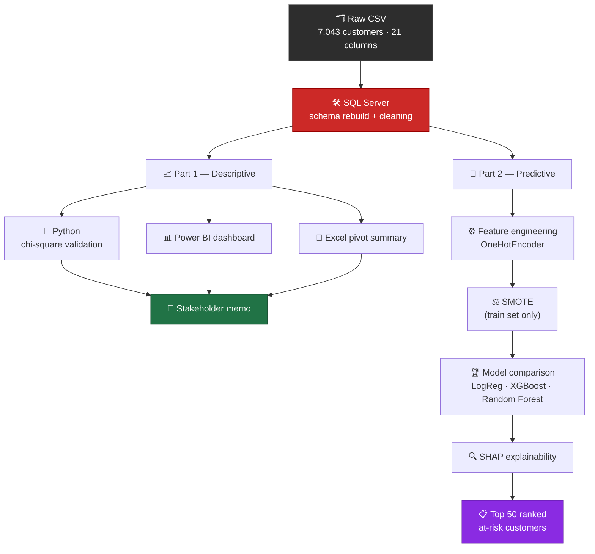
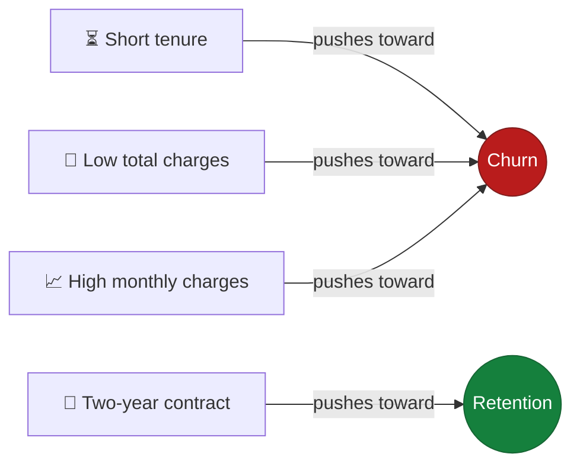

<div align="center">

# 📉 Why Are We Losing Customers?

### An end-to-end telecom churn investigation — from a raw CSV to a statistically validated, explainable prediction model


<sub>Dataset: <a href="https://www.kaggle.com/datasets/blastchar/telco-customer-churn">Telco Customer Churn</a> (Kaggle) · 7,043 customers · 21 columns</sub>

</div>

<br>

<div align="center">

| 📊 Overall churn | 🥇 Highest-risk segment | 🧪 Statistical checks | 🎯 Final model recall | 📋 Actionable output |
|:---:|:---:|:---:|:---:|:---:|
| **26.53%** | Month-to-month, **42.71%** | **4 / 4** significant (p ≪ 0.05) | **78%** | Top 50 at-risk customers |

</div>

<br>

## 📚 Table of contents

- [Why this project exists](#-why-this-project-exists)
- [How it fits together](#-how-it-fits-together)
- [Project structure](#-project-structure)
- [Part 1 — Descriptive analysis](#-part-1--descriptive-analysis-sql--python--power-bi--excel)
- [Part 2 — Prediction model](#-part-2--prediction-model-sql--scikit-learn--shap)
- [Key decisions worth defending in an interview](#-key-decisions-worth-defending-in-an-interview)
- [Tech stack](#-tech-stack)

<br>

## 🧭 Why this project exists

Most churn portfolio projects stop at one tool and one chart. This one is built to show two things a single-tool project can't:

1. The **same clean dataset** can power two different deliverables — a descriptive analysis *and* a predictive model.
2. Every non-trivial decision along the way — a data type, a `NULL` vs. `0`, a model metric — was made **deliberately** and can be defended, not just defaulted to.

<br>

## 🔀 How it fits together



<br>

## 🗂 Project structure

```
Customer Churn/
├── sql/
│   ├── 01_database_schema_setup.sql
│   ├── 02_data_cleaning.sql
│   └── 03_eda_business_questions.sql
├── python/
│   ├── requirements.txt
│   ├── churn_stats_validation.ipynb      # SQL → Python, chi-square tests
│   └── CCprediction.ipynb                # feature engineering → SHAP → top-50 output
├── powerbi/
│   └── churn_dashboard.pbix
├── excel/
│   └── churn_pivot_summary.xlsx
├── stakeholder_memo.docx
└── churn-showcase.jsx
```

<br>

## 📈 Part 1 — Descriptive analysis (SQL → Python → Power BI → Excel)

**Goal:** find out who's churning and why, and prove the findings hold up statistically, in a form a stakeholder can act on.

<details>
<summary><b>🧱 Data foundation</b> — a real data-loss bug, not a hypothetical one</summary>
<br>

The SSMS Import Wizard silently mistyped multi-category text columns as `BIT`, collapsing values like *"No internet service"* into `NULL`. The schema was rebuilt by hand instead:

- Categorical columns with 2+ values → `VARCHAR`
- Truly binary columns (confirmed, not assumed) → `BIT`
- `TotalCharges` → imported as `VARCHAR`, since `BULK INSERT` can't guarantee a safe direct numeric conversion for its 11 blank values
- A separate `TotalCharges_Cleaned FLOAT` column added via `TRY_CAST`, with blanks set to `NULL` — not `0` — because a `tenure = 0` customer hasn't completed a billing cycle yet; `0` would misrepresent that as a confirmed zero-spend customer

</details>

### 🔎 Key findings (SQL)

| Segment | Highest-risk group | Churn rate | vs. lowest |
|---|---|:---:|---|
| Contract type | Month-to-month | **42.71%** | 15× Two-year (2.83%) |
| Payment method | Electronic check | **45.29%** | ~3× other methods |
| Internet service | Fiber optic | **41.89%** | 2.2× DSL (18.96%) |
| Tenure | New (<12 months) | **48.28%** | 2.75× Established (17.49%) |

> Overall churn rate: **26.53%** — roughly 1 in 4 customers.

### ✅ Statistical validation (Python)

Each relationship above was tested with `scipy.stats.chi2_contingency` (chi-square test of independence) to confirm it's a real pattern, not sampling noise:

| Factor | p-value | Significant? |
|---|---|:---:|
| Contract type | 5.86 × 10⁻²⁵⁸ | ✅ |
| Payment method | 3.68 × 10⁻¹⁴⁰ | ✅ |
| Internet service | 9.57 × 10⁻¹⁶⁰ | ✅ |
| Tenure group | 3.07 × 10⁻¹⁵⁶ | ✅ |

**All four relationships are statistically significant (p ≪ 0.05).**

### 🖥️ Dashboard & cross-tool verification

A live-connected Power BI dashboard (title, KPI card, top-3 risk-segment summary, 4 segment charts, 2 interactive slicers) and a matching Excel pivot-table summary were both built directly off the cleaned SQL table.

**Every percentage matches exactly across SQL, Python, Power BI, and Excel** — four independent tools, same numbers, every time.

### 📤 Deliverable

A one-page stakeholder memo (`stakeholder_memo.docx`) translating the above into plain-language recommendations: incentivize longer contracts, prioritize early-tenure (<12 month) retention outreach, and investigate the electronic-check and fiber-optic churn gaps directly with customers.

<br>

## 🤖 Part 2 — Prediction model (SQL → scikit-learn → SHAP)

**Goal:** predict which *currently active* customers are most likely to churn, and explain why — reusing Part 1's cleaned data rather than redoing the cleaning work.

<details>
<summary><b>⚙️ Feature engineering</b></summary>
<br>

- `OneHotEncoder` (via `ColumnTransformer`) for categorical features, `drop='first'` to avoid redundant columns
- `SeniorCitizen` converted directly to `int` rather than one-hot encoded, since it's genuinely binary — a redundant pair of columns would have added no information
- `customerID` excluded from features (no predictive signal — it's a unique label, not a repeating pattern a model can learn from) but kept alongside predictions for the final ranked output
- 11 rows with missing `TotalCharges_Cleaned` dropped (0.15% of data); imputing was rejected for the same reason as the SQL stage — it would fabricate a value where the honest answer is "not yet known"

</details>

<details>
<summary><b>⚖️ Class imbalance</b></summary>
<br>

Churn is a ~73.5% / 26.5% split. **SMOTE** was applied to the training set only (never the test set, to avoid synthetic data leaking into evaluation) to balance classes before training.

</details>

### 🏆 Model comparison

Three model families were tested. XGBoost and Random Forest were each tuned with their own native imbalance handling (`scale_pos_weight`, `class_weight='balanced'`) as an alternative to SMOTE, after SMOTE alone underperformed on tree-based models.

| Model | Accuracy | **Recall** | Precision | F1 |
|---|:---:|:---:|:---:|:---:|
| **Logistic Regression (SMOTE)** ⭐ | 75% | **78%** | 52% | 62% |
| XGBoost (SMOTE) | 79% | 53% | 62% | 57% |
| XGBoost (`scale_pos_weight`) | 76% | 68% | 54% | 60% |
| Random Forest (`class_weight`) | 79% | 47% | 63% | 54% |

> **Logistic Regression was selected as the final model — not the model with the highest accuracy.** Recall was prioritized because a false negative (a missed churner) costs the business a lost customer, while a false positive (a false alarm) costs one unnecessary retention offer to a customer who was staying anyway. On that basis, the simplest model tested was also the most effective one.

### 🔍 Explainability (SHAP)

A global SHAP summary plot confirms the model's decisions align with the Part 1 findings, independently:



- **Tenure** — the strongest driver; short tenure pushes predictions toward churn
- **Total charges** — low lifetime spend pushes toward churn (a downstream effect of short tenure)
- **Monthly charges** — higher monthly bills push toward churn
- **Two-year contract** — presence pushes predictions toward retention

### 📋 Output

`predict_proba` was run across all active (non-churned) customers, and the **top 50 ranked by predicted churn probability** form the model's actionable output — a list a retention team could work from directly, not a notebook metric.

<br>

## 🧠 Key decisions worth defending in an interview

| Decision | Why it matters |
|---|---|
| `NULL` vs. `0` for `TotalCharges` | Statistical honesty — excludes new customers from averages rather than dragging them down |
| Reusing Part 1's cleaned table for Part 2 | Deliberate pipeline architecture, not laziness — documented explicitly rather than left implicit |
| SMOTE on training data only | Avoids synthetic-data leakage into evaluation |
| Recall over accuracy, and over a "smarter-looking" model | Logistic Regression beat XGBoost and Random Forest on the metric that actually reflects the business cost of a missed churner |
| Chi-square before trusting any percentage gap | A 15× difference in churn rate isn't a finding until it's shown to not be sampling noise |

<br>

## 🛠 Tech stack

<div align="center">

-CC2927?style=flat-square&logo=microsoftsqlserver&logoColor=white)


-61DAFB?style=flat-square&logo=react&logoColor=black)

</div>

<br>

<div align="center">
<sub>SQL Server (SSMS) · Python (pandas, scipy, scikit-learn, SHAP, pyodbc) · Power BI Desktop (DAX) · Excel (PivotTables) · React (showcase)</sub>
</div>
